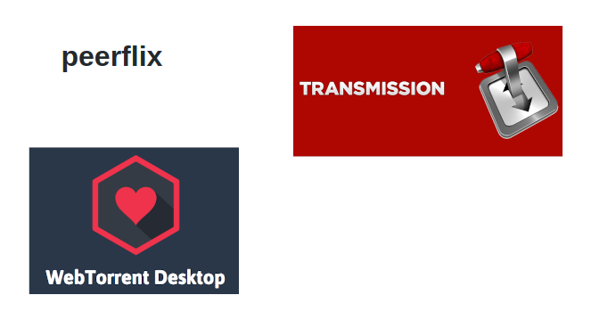

# Descentralizando la Web

---

### Martín Acosta
#### `@tinchoz49`
#### Trabajo en `Geut`.


---


### Desarrollamos aplicaciones y módulos sobre tecnologías P2P.

---

# Agenda

- Contexto
- Qué es `Dat`?
- Compartir y descargar con `Dat CLI`
- Crear una web descentralizada con `Beaker`
- Dat Awesome

---

# dat://contexto

---


---


---


---


## Decisión de negocio

---


---


---


---


---

# BitTorrent

---



---


---


---

# Varias cosas

---

# Un protocolo P2P

#### Diseñado para la sincronización eficiente de grandes volumenes de datos.

---

> Parecido a BitTorrent pero con mejoras.

---

## Qué mejoras?

- Optimizado para la modificación y acceso de la información.
- Encriptación de datos.

---

## Un conjunto de modulos

> Todo desarrollado en JavaScript


---

# Un CLI


---

# Una comunidad

###### https://dat.foundation
###### https://comm-comm.datproject.org


---

# dat://cli

`Dat CLI` nos permite **compartir** o **descargar**
directorios/archivos :open_file_folder: de nuestro sistema
con otrxs :heart:.

---


---


---


---


---


---


---


---


---


# Beaker

Browser diseñado para explorar y construir una web P2P.

---

> Construido utilizando los modulos que componen a **Dat**.

---


---


---

# Beaker API

### DatArchive

```javascript
var mySite = await DatArchive.create({title: 'My site'});
mySite.url // dat://1277b9...
await mySite.writeFile('index.html', 'Hello, world!');
```

---

# dat://awesome

---

### Cabal

https://cabal.chat


---


---


### P2PCommons SDK (ese dk)

https://github.com/p2pcommons/sdk-js

The peer-to-peer commons is all about creating, remixing, and sharing.

---


Biblioteca de módulos open source para el desarrollo de aplicaciones P2P en `JavaScript`.

---


---


> Sólo aquellos que están cegados por la codicia se negarían a hacerle una copia a un amigue.

---

# Gracias

@tinchoz49

---
